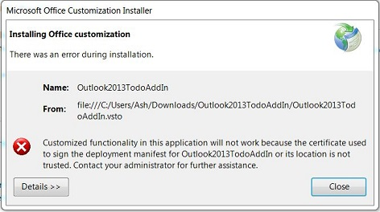
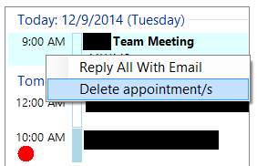
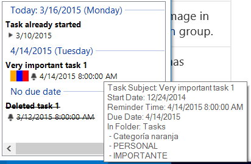
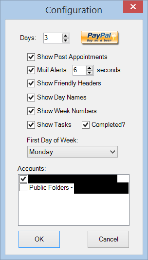
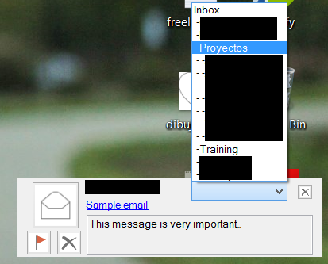

# **CodePlex is shutting down!**

<
As you may already know, after all these amazing years CodePlex is going to stop working, so I've decided to move the binaries over to [my blog](http://blog.gamosoft.com/) to be downloaded from now on. Please use [this direct link to the project](http://blog.gamosoft.com/outlook-2013-calendar-add-in/) to update your bookmarks.
I'll probably put the code elsewhere but for the moment my blog is where you can keep updated of what's going on with the project (or ask questions, etc...). The project will still remain in Codeplex until the site is closed but will no longer be updated.

Thanks for these years CodePlex!!!

**Project Description**
Adds extended appointment calendar to see events for several upcoming days, and enhanced new email notification system to delete/flag incoming emails.

This project was born because after moving to the new Outlook 2013, a lot of nice and useful features were strangely "lost" in the upgrade from versions like 2010 or even 2007.

It started as a personal project to include these options in my own daily work, but some colleagues were interested in it, so I decided to include it in Codeplex for everybody to download and mess around with it if you like it too. You're absolutely free to download it, and do whatever you want to do with the code if you wish, which BTW is provided as-is. ;-)

< If you find it useful and have spare time you can drop me a line saying how you like the tool and such, or better yet, you can buy me a beer if you wish. ;-) 

You will have to uninstall any previous version (add/remove programs) if you had installed it before.
You might need to install it as an administrator to avoid issues.

Before unzipping the file please "unblock" it (right-click -> properties -> unblock) to avoid issues when installing, then unzip the file and double-click the VSTO file on the root folder to install it. Some people suggest downloading it with different browsers as well (please read the issues and discussions lists). If you don't unblock the file you'll get the following error:

**Upcoming appointments**
One of the things that I missed a LOT from 2010 was the ability to see upcoming appointments for the following days in the to-do task pane.

It's very weird but in version 2013 this option has disappeared, so you can only see the appointments for the current day, which most people may not think of it as a big issue, but say you have a meeting tomorrow at 6:30 am, you won't be able to see it today and could probably miss it... ;-)

For this I have implemented a new pane that docks to the right of the Outlook window and shows the calendar and a list of future appointments within a certain range of upcoming days:

It will show appointments with their categories and status similar to what it did in Outlook 2010.

I have implemented basic functionality, such as double-clicking the item to open it up (and in case of a recurring meeting to either open one or all of them):

You can also right-click an item and select "Reply all with email" to create a new mail item with all recipients of the appointment (thanks Walter! ;-D).
Now you can delete appointments (whether one or multiple occurrences) directly from this pane, after a confirmation message is shown to the user:

Synchronization is not 100%, so if you create or delete an appointment it will not automatically show up in the new list. The list currently responds to date changes and number of upcoming days, so I've also provided a way to reload all appointments by clicking on the "today" link (the current date, next to the gear icon to open up the settings dialog).

This is not very polished and some bugs may come up, so please let me know and I'll try my best to fix them. Also suggestions are welcome (depending on my availability).

**Tasks and To-Do Items**
Finally, after many people requesting it, I included a second panel underneath that will show the tasks in the system sorted by due date (if option selected in the configuration).
It shows the task subject, categories (if any) and reminder time. If no reminder time has been set it'll show the task start date.

Please note this is still work in progress and I just released it to see people's comments and expand on this. Double-clicking the task should open up the item to take the necessary action on it, as well as right-clicking on a task will present options to complete or delete a task.
A known issue is that it doesn't fully restore the scrollable splitter between panels, but I will look into that time permitting. ;-)

**Multiple calendars**
It was a very popular request to add support for multiple calendars and now the appointments shown in the pane will be selected from the configured list of calendars to choose from (see configuration below). As of now only those calendars under the "My Calendars" section will show up, and there are some timeout issues with accounts such as "public folders".
Also they will show in the same font/color, so drop me a line on a suggestion to better show them, as I think the look and feel may be confusing with color categories.

**Configuration**
Configuration can be accessed now through the little gear icon in the calendar, to claim more space for items (after removing the buttons). You can select the following options:

- Number of days to show from the selected date onwards.
- Allow users to show/hide previous appointments in the day.
- Enable/disable new email alert notifications.
- Seconds the email alert pop-up remains visible in the screen.
- Show/hide friendly group header names for specific dates (yesterday, today and tomorrow).
- Show/hide an additional column with the week numbers.
- Show/hide tasks panel.
- Allow to see tasks already marked as completed or not.
- Choose first day of the week.
- List of accounts to show calendars from.

**Email notifications**
Another thing that is really frustrating (IMHO) is the new email alert system that's implemented in Outlook 2013. It just shows a summary of the email and you can only click it to open the email, or dismiss the alert.

In previous versions you also had the option to either delete it directly from the notification window (bye bye spam!) or even flag it, so that's what I have implemented here:

I've also added a dropdown list that allows the user to move incoming email messages to the desired folder if something is selected (just by choosing an entry in the list, so be careful).

**Email appointments**
A new feature introduced is the ability to create appointments by dragging & dropping emails into one day of the calendar. It will use all recipients in the selected emails to do so, and the last email body and subject to compose the appointment.
By default will create it on the designated day, using current's day time rounded up within the following 15 minutes.

Remember, this was part of a personal project and I may be extending these functionalities or not depending on my availability, so use it at your own risk.

I hope you guys like it too. :-)
Kind regards.

**Other projects**
Here are other projects you might be interested in as well:

* [http://entlibextensions.codeplex.com](http://entlibextensions.codeplex.com)
* [http://fiddlertreeviewpanel.codeplex.com](http://fiddlertreeviewpanel.codeplex.com)
* [http://slbindabledatagrid.codeplex.com](http://slbindabledatagrid.codeplex.com)
* [http://endomondoexport.codeplex.com](http://endomondoexport.codeplex.com)
* [http://sharepointdocgen.codeplex.com](http://sharepointdocgen.codeplex.com)